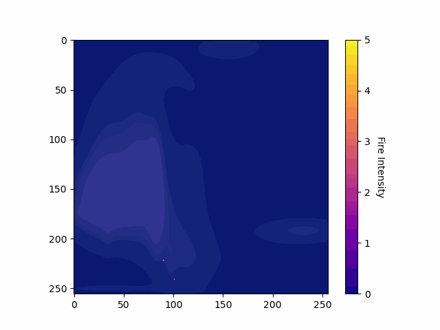

## Fire Simulator

Stochastic modelling of the spread of fire with variable response time/intensity/wind speed and direction.

Implemented topology assuming 2D gaussian distributions for elevation. Assumed higher zones have less chance of catching fire, and are harder to extinguish.
